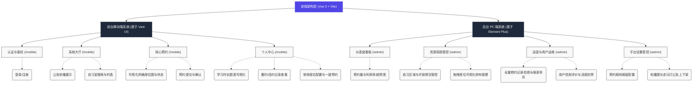
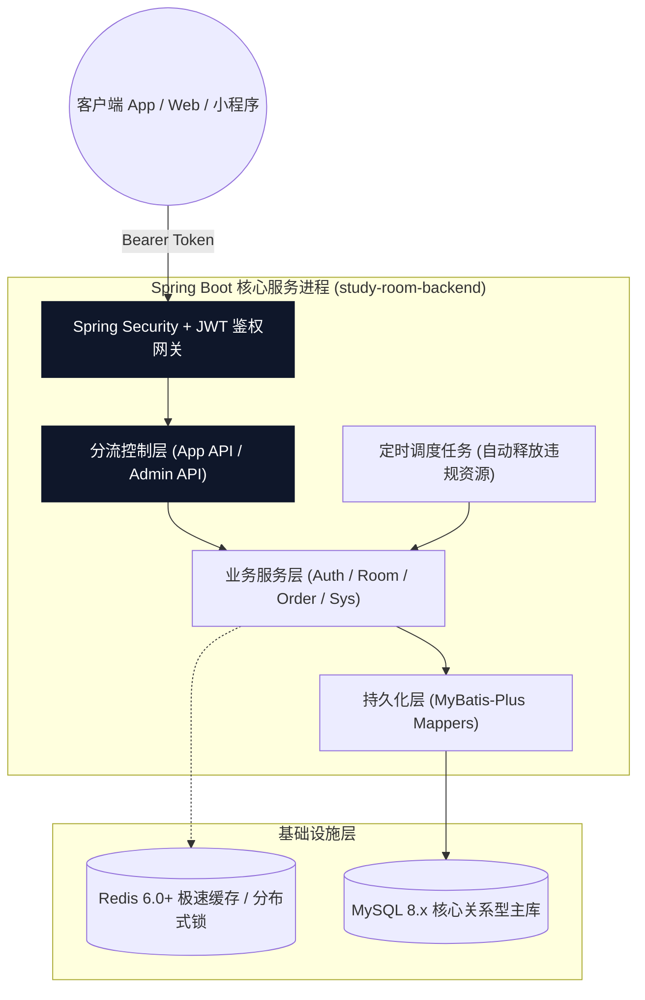
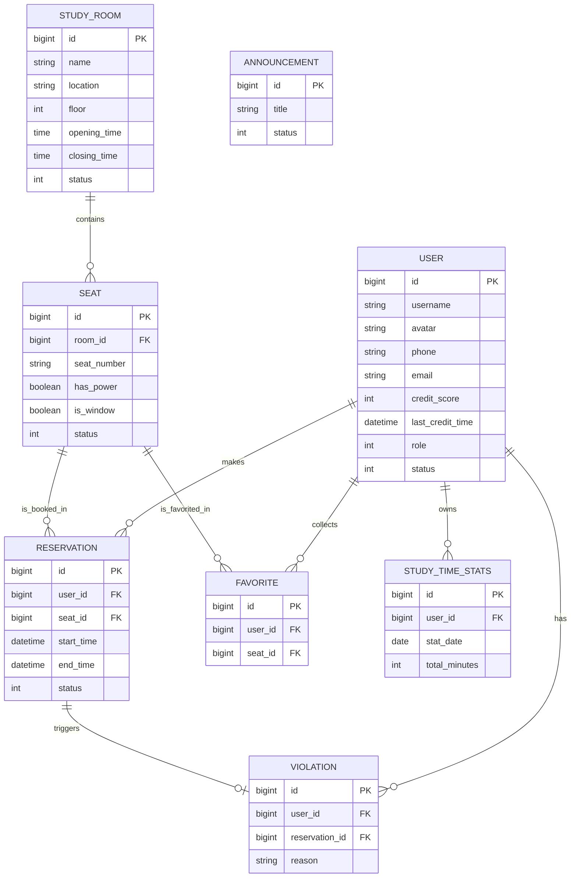
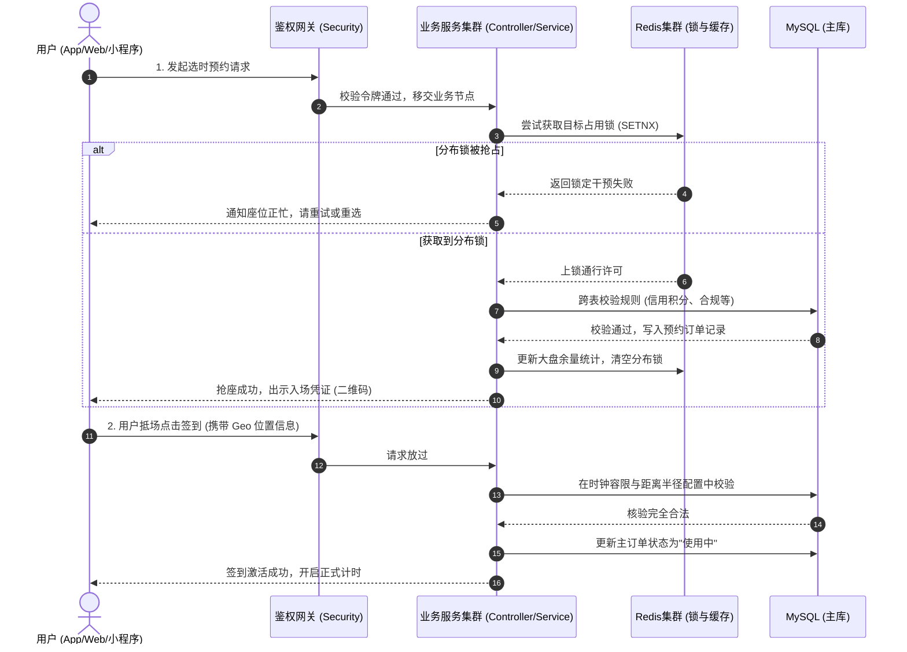

# 自习室座位预约系统 - 架构设计文档

本文档基于各个需求文件与业务设计（README、前/后端文档、API规范及设计稿），描述了自习室座位预约系统的整体架构设计，包含了前端页面与组件结构、后端服务模块划分、核心数据库交互（ER模型），以及典型的预约业务交互流程。

---

## 1. 前端架构（页面/组件结构）

前端总体采用 **Vue 3 + Vite** 构建，通过 **Pinia** 进行全局状态管理，并且**基于 Axios 封装 HTTP 请求**。根据目标受众与生态的不同，视图层划分为两个端：
- **移动端（用户前台）**：基于 **Vant 4.x** 组件库进行定制设计，服务于广大学生和考研用户群体，包含在线选座可视化渲染、扫码定位签到、学习时长统计以及快捷预约等高频交互环境。
- **PC 端（管理后台）**：基于 **Element Plus** 搭建，面向自习室系统管理员，提供基于 ECharts 的数据仪表盘、灵活的拖拽式网格布局管理以及复杂的运营数据检索与处置功能。

---

## 2. 后端架构（服务/模块划分）

后端采用 **Spring Boot 3.x 单体架构** 进行开发。利用 Spring Security + JWT 统一承担安全与鉴权任务。使用 Redis 进行极速查询与并发防冲突（分布式锁机制）。同时借助 MyBatis-Plus 提高持久层开发效率。

- **认证防线**：所有非公共接口进入业务节点前，由 Spring Security 验证并解析 JWT，拒绝非法探测，且利用 Redis 支撑高可用 Token 黑名单或延期机制。
- **Controller 端口分流**：区分移动端操作与管理后台（如 `/api/admin`）；后台接口自动叠加更高权限的断言判定。
- **并发调度机制**：预约引擎（`OrderSvc`）作为系统的核心高并发出口，利用 Redis 的分布式锁以实现安全抢座环境，避免严重并发情况下的“一号多占”超卖现象。
- **异步与定时任务**：使用 Spring Task或Quartz在固定频率异步跑批校验预约时长，对逾期未入座、临时离席超时的座位强制释放，联动生成用户的违规记录。

---

## 3. 数据库设计（ER 图）

主要围绕业务载体进行建模，利用 MySQL 持久化储存和 MyBatis Plus 简化操作：

---

## 4. 系统交互流程

以下以最典型的业务行为 **“用户选座及并发情况下的抢座、校验防超发签到全链路”** 为例，梳理系统各个层级的调用与验证响应路径：

