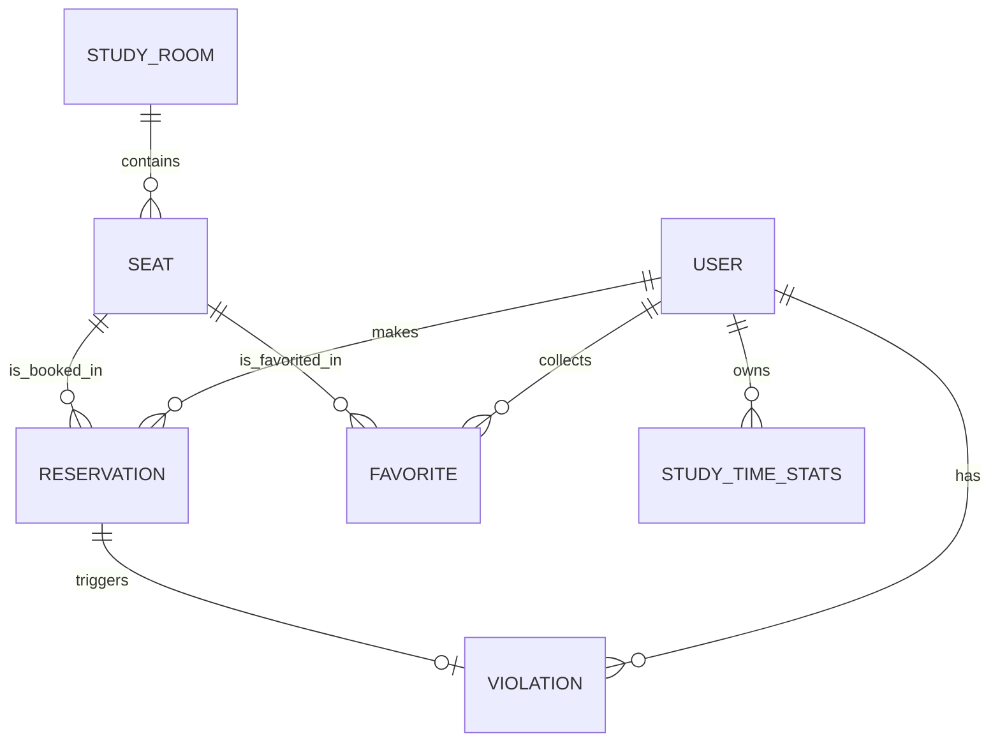

# 自习室座位预约系统

[](https://github.com/2312190606/StudyRoom-Booking-System/actions)
[](https://codecov.io/gh/2312190606/StudyRoom-Booking-System)
[](https://codecov.io/gh/2312190606/StudyRoom-Booking-System)


**文档版本**: v1.0  
**撰写日期**: 2026-06-13  
**团队成员**: 刘苏鸿 (2312190606)、李泽亿 (2312190618)

---

## 目录

1. [项目介绍](#一项目介绍)
2. [版本控制与团队协作](#二版本控制与团队协作)
3. [UI/UX 设计与原型](#三uiux-设计与原型)
4. [软件架构设计](#四软件架构设计)
5. [API 设计](#五api-设计)
6. [前端实现](#六前端实现)
7. [后端实现](#七后端实现)
8. [AI 工程化应用](#八ai-工程化应用)
9. [安全设计](#九安全设计)
10. [软件测试](#十软件测试)
11. [持续集成与持续交付](#十一持续集成与持续交付)
12. [系统部署](#十二系统部署)
13. [云服务应用](#十三云服务应用)
14. [可观测性与监控](#十四可观测性与监控)
15. [性能优化](#十五性能优化)
16. [功能展示](#十六功能展示)
17. [总结与展望](#十七总结与展望)
18. [参考文献](#参考文献)
19. [AI 使用声明](#ai-使用声明)
20. [第三方库与开源引用](#第三方库与开源引用)
21. [项目结构](#项目结构)

---

## 一、项目介绍

### 1.1 背景与问题陈述

**负责人**: 刘苏鸿、李泽亿

高校自习室座位资源长期以来面临着"一座难求"与资源分配不均的双重问题。在考试周等高峰期，学生常常需要提前占座，甚至出现"占座不来"的浪费现象。传统的课堂点名或纸质签到系统效率低下，无法满足现代化移动端用户的需求。

本项目旨在开发一款面向高校学生和考研人群的移动端 Web 应用，提供实时座位状态查看、在线预约、扫码签到、学习时长统计等功能，帮助学生高效规划学习时间，提高自习室座位利用率。

**传统方案的痛点**:
- 现场排队耗时费力
- "占座不来"导致资源浪费
- 无法实时了解座位余量
- 管理员难以统一管理

**移动端解决方案的优势**:
- 随时随地查看座位状态
- 在线预约，公平透明
- 扫码签到，自动核销
- 数据统计，科学管理

### 1.2 项目目标与核心功能

**负责人**: 刘苏鸿、李泽亿

本项目要实现以下核心功能：

**功能性需求**:
- 用户注册、登录、JWT 认证
- 实时查看自习室列表及座位状态
- 可视化座位图（颜色区分可用/已占/维修状态）
- 在线预约座位（时间段选择、冲突校验）
- 扫码签到（地理位置校验）
- 预约管理（取消、延后、查看历史）
- 个人中心（学习时长统计、违约记录）
- 常用座位收藏与一键预约
- 管理后台（仪表盘、自习室管理、用户管理、公告管理）

**非功能性需求**:
- **性能**: API 响应时间 < 200ms，支持高并发预约场景
- **可用性**: 系统可用性 > 99.9%，部署在云平台确保稳定
- **安全性**: JWT 认证、密码加密存储、SQL 注入防护
- **移动端适配**: 响应式设计，适配各种屏幕尺寸

### 1.3 技术选型

**负责人**: 李泽亿

| 层级 | 技术选型 | 选型理由 |
|------|----------|----------|
| 前端框架 | Vue 3 + Vite | 组合式 API、更好的 TypeScript 支持、快速构建 |
| UI 组件库 | Vant 4.x (移动端) / Element Plus (桌面端) | Vant 轻量级适合移动端，Element Plus 适合后台复杂交互 |
| 状态管理 | Pinia 2.x | Vue 3 官方推荐，比 Vuex 更简洁 |
| 后端框架 | Spring Boot 3.x | Java 17+ 新特性、性能与安全性提升 |
| 安全框架 | Spring Security + JWT | 无状态认证，适合分布式部署 |
| 数据库 | MySQL 8.x | 成熟稳定，关系型数据存储 |
| 缓存 | Redis 6.0+ | 高性能缓存、分布式锁支持 |
| ORM | MyBatis-Plus | 简化 CRUD 操作、强类型查询 |
| 部署 | Vercel (前端) + Railway (后端) | 免费额度、快速部署、CDN 支持 |

### 1.4 团队分工

**负责人**: 刘苏鸿、李泽亿

| 姓名 | 学号 | 负责模块 |
|------|------|----------|
| 刘苏鸿 | 2312190606 | 前端开发（Vue 3组件、页面路由、AI客服组件）、CI/CD配置 |
| 李泽亿 | 2312190618 | 后端开发（Spring Boot、API设计、数据库）、架构设计、部署 |

---

## 二、版本控制与团队协作

### 2.1 分支策略

**负责人**: 刘苏鸿、李泽亿

本项目采用 **GitHub Flow** 分支模型：

```
main (保护分支)
├── develop (开发分支)
│   ├── feature/lzy-backend-docs
│   ├── feature/lsh-frontend-doc
│   └── ...
```

- `main`: 生产环境分支，受到保护，需要 PR 和 CI 通过才能合并
- `develop`: 开发集成分支
- `feature/*`: 功能分支，完成后合并到 develop

**分支保护规则**:
- `main` 分支禁止直接推送
- 所有合并需要至少 1 个审查通过
- CI 检查必须通过才能合并

### 2.2 提交规范

**负责人**: 刘苏鸿、李泽亿

本项目采用 **Conventional Commits** 规范：

```
<type>(<scope>): <subject>

# 示例
feat(reservation): 添加座位预约功能
fix(auth): 修复登录 token 刷新问题
docs(api): 更新 API 文档
test(backend): 添加用户认证测试用例
```

**提交类型**:
- `feat`: 新功能
- `fix`: 错误修复
- `docs`: 文档更新
- `style`: 代码格式（不影响功能）
- `refactor`: 重构
- `test`: 测试相关
- `chore`: 构建/工具相关

### 2.3 协作统计

**负责人**: 刘苏鸿、李泽亿

**代码提交统计**（部分示例）：

| 提交 | 作者 | 描述 |
|------|------|------|
| 0923078 | 刘苏鸿 | 完善AI提示词 |
| dab1b3a | 刘苏鸿 | 完善页面 |
| 4905bbd | 刘苏鸿 | 修复bug |
| 906d839 | 刘苏鸿 | 移动端适配 |
| 15b748b | 李泽亿 | 完善预约，签到等功能 |
| a038ba6 | 李泽亿 | 监控配置部署 |

**GitHub Insights 关键指标**:
- 前端覆盖率: 83%
- 后端覆盖率: 65%
- 测试用例: 221 个通过

---

## 三、UI/UX 设计与原型

### 3.1 用户画像与场景分析

**负责人**: 李泽亿

**目标用户群体**:
- **在校大学生/考研人群/职场考证者**: 对图书馆或指定自习室座位有高频刚需，希望随时通过手机获知座位空闲情况
- **自习室/图书馆管理员**: 需要高效分配和调度座位资源，准确掌握实时入座率

**核心用户场景**:

**场景一：提前规划与预约选座**  
复习周即将来临，用户小明计划明天早上 8 点去图书馆自习。为了避免找不到座位，他提前一天晚上在宿舍通过手机打开系统，直观查看各区域的空闲座位分布图，并挑选了一个靠窗位置，提交并获得了明日早上的座位预约凭证。

**场景二：现场入座与中途暂离**  
用户小李到达自习室后，扫描桌面上的座位二维码完成"入座签到"。中午到了就餐时间，她并不打算带走书本，于是在手机端点击"暂离"按钮，系统为她保留该座位 60 分钟。

**场景三：管理员的高效纠察与释放利用**  
临近考试，座位非常紧张。管理员老王巡查时发现某个座位放着书包但很久无人，他通过管理员后台查验该座位状态，确认用户长时间离开且未点"暂离"，便直接在系统中标记违规并释放该座位。

### 3.2 界面原型设计

**负责人**: 刘苏鸿、李泽亿

**配色方案**:
- 主色: #4F46E5（蓝紫色 - 品牌色、主视觉背景、主要操作按钮）
- 辅助色: #F8FAFC（浅灰色 - 大面积前台背景色）、#0F172A（深石板灰 - 管理后台深色背景）
- 强调色: #10B981（成功绿）、#EF4444（危险红）、#F59E0B（活力黄）

**核心页面设计**:

1. **前台 - 首页**: 自习室发现卡片流，展示各大区域分类入口、全校实时余座概览及区域公告。提供显著的"一键预订"快捷通道。

2. **前台 - 选座与预订**: 交互式可视化座位分布图，通过色彩区分座位状态（可选、已选、维修中等状态）。多时间段滑动选择组件及实时冲突校验面板。

3. **前台 - 我的预约**: 状态驱动的预约卡片流设计。当前生效订单提供大尺寸签到二维码生成及入座签到按钮；提供"暂离 / 返回入座 / 提早签退"流控面板。

4. **前台 - 个人中心**: 用户专属数据驾驶舱，呈现学习时长与天数统计表。集成了信用积分体系视图及违纪预警记录。

5. **后台 - 仪表盘看板**: 全景数据监控，包含今日座位利用率、活跃入座总人数折线图，以及违规占座处理预警。

6. **后台 - 自习室与座位管理**: 卡片式管理各区域自习室列表，支持拖拽式座位配置。

**设计理念**:
- 移动端优先设计，简化操作流程
- 颜色语义统一（绿色可用、红色已占、灰色维修）
- 状态徽章明确，减少用户认知负担
- 点击热区合理，避免误触

### 3.2.1 交互设计原则

**负责人**: 刘苏鸿、李泽亿

- **页面切换交互**: 点击前台顶栏或后台侧边栏，高亮当前活跃菜单并平滑切换页面对应内容
- **模块状态交互**: 鼠标悬停（Hover）在自习室卡片或深色卡片列表时，出现微阴影浮动或背景高亮提升点击感知
- **条件检索过滤**: 后台管理列表顶部均支持输入关键字进行动态聚合检索，点击状态标签可直接切换展示目标数据分类
- **弹窗与验证管理**: 在点击"出示签到码"、"编辑"、"新增"等操作时触发页面居中弹窗/侧边抽屉进行聚焦操作
- **快速开关控制**: 开关（Switch）控件切换即触发接口变更、呈现即时开闭状态反馈

### 3.2.2 用户体验设计

**负责人**: 刘苏鸿、李泽亿

- **加载速度优化**: 路由懒加载、图片压缩、骨架屏占位
- **操作便捷性**: 底部导航栏、单手操作优化、大按钮触控区域
- **视觉设计**: 统一色彩语义、清晰状态区分、适度留白

**Figma 原型链接**: https://iso-ruby-33600287.figma.site/

---

## 四、软件架构设计

**负责人**: 李泽亿

### 4.1 整体架构

本系统采用 **前后端分离架构** 进行开发，前端为单页面应用（SPA），后端为 RESTful API 服务。

```
┌─────────────────────────────────────────────────────────────┐
│                        客户端层                               │
│  ┌─────────────┐  ┌─────────────┐  ┌─────────────┐            │
│  │  移动端 Web │  │  管理后台   │  │   小程序    │            │
│  │ (Vant UI)  │  │(Element Plus)│            │            │
│  └──────┬──────┘  └──────┬──────┘  └──────┬──────┘            │
└─────────┼────────────────┼────────────────┼──────────────────┘
          │                │                │
          ▼                ▼                ▼
┌─────────────────────────────────────────────────────────────┐
│                     API 网关层 (Spring Security + JWT)      │
└─────────────────────────────────────────────────────────────┘
          │
          ▼
┌─────────────────────────────────────────────────────────────┐
│                      业务逻辑层                              │
│  ┌─────────────┐  ┌─────────────┐  ┌─────────────┐           │
│  │  认证服务   │  │  预约服务   │  │  统计服务   │           │
│  │ AuthService│  │RoomService │  │StatsService│           │
│  └─────────────┘  └─────────────┘  └─────────────┘           │
└─────────────────────────────────────────────────────────────┘
          │
          ▼
┌─────────────────────────────────────────────────────────────┐
│                      数据访问层                              │
│  ┌─────────────┐  ┌─────────────┐  ┌─────────────┐           │
│  │ MyBatis-Plus│  │   Redis    │  │   MySQL    │           │
│  │  Mapper    │  │  缓存/锁   │  │   主库     │           │
│  └─────────────┘  └─────────────┘  └─────────────┘           │
└─────────────────────────────────────────────────────────────┘
```

### 4.2 技术架构分层

### 4.2.1 表现层（前端）

**负责人**: 刘苏鸿

前端采用 **Vue 3 + Vite** 构建，通过 **Pinia** 进行全局状态管理，基于 **Axios 封装 HTTP 请求**。

**前端模块结构**:
```
frontend/src/
├── api/                 # API 接口封装
├── components/          # 可复用组件（AIChat、Navbar等）
├── layouts/            # 布局组件（UserLayout、AdminLayout）
├── router/            # 路由配置
├── stores/            # Pinia 状态管理
├── views/             # 页面组件
│   ├── mobile/       # 移动端页面
│   └── admin/       # 管理端页面
└── mocks/            # Mock 数据
```

### 4.2.2 业务逻辑层（后端）

**负责人**: 李泽亿

后端采用 **Spring Boot 3.x 单体架构** 进行开发，利用 Spring Security + JWT 统一承担安全与鉴权任务。

**后端模块结构**:
```
backend/src/main/java/com/example/studyroom/
├── config/           # 系统级配置（Security、Redis、MyBatisPlus）
├── controller/      # REST API 端点（/api 与 /api/admin）
├── service/        # 业务接口逻辑（Service 及其 impl 实现层）
├── mapper/         # 数据库映射接口（MyBatis Mapper）
├── model/         # 数据模型
│   ├── entity/    # 数据库表映射实体类
│   ├── dto/      # 数据传输对象
│   └── vo/      # 视图展现对象
├── common/       # 公共组件（异常处理、统一响应）
├── security/     # 安全与 JWT 认证校验过滤器
└── task/         # 定时任务处理
```

### 4.2.3 数据访问层

**负责人**: 李泽亿

**数据库设计**（ER 图）:



**核心表结构**:

| 表名 | 说明 | 关键字段 |
|------|------|----------|
| users | 用户表 | id, username, password, credit_score, role |
| study_rooms | 自习室表 | id, name, location, opening_time, closing_time |
| seats | 座位表 | id, room_id, seat_number, position_x, position_y |
| reservations | 预约表 | id, user_id, seat_id, start_time, end_time, status |
| violations | 违约记录表 | id, user_id, reservation_id, reason |
| favorites | 收藏表 | id, user_id, seat_id |
| study_time_stats | 学习时长统计表 | id, user_id, stat_date, total_minutes |
| announcements | 公告表 | id, title, content, status |

### 4.3 关键设计决策

**负责人**: 李泽亿

| 决策项 | 选择 | 理由 |
|--------|------|------|
| 为什么选 REST 而不是 GraphQL | REST | API 简单直观，便于调试和文档化，适合本项目规模 |
| 为什么选 MySQL 而不是 MongoDB | MySQL | 关系型数据、成熟稳定、团队熟悉 |
| 为什么选 Redis 做并发控制 | Redis | 高性能、支持分布式锁、适合高并发预约场景 |
| 为什么选 Spring Security + JWT | Spring Security + JWT | 无状态认证、适合分布式部署、与 Spring Boot 集成良好 |

---

## 五、API 设计

**负责人**: 刘苏鸿、李泽亿

### 5.1 设计原则

本系统遵循 **RESTful API** 设计原则：

- **资源命名**: 使用名词复数形式（如 `/reservations`、`/rooms`）
- **HTTP 方法**: GET（查询）、POST（创建）、PUT（更新）、DELETE（删除）
- **版本控制**: 通过 URL 路径版本控制（如 `/api/v1/...`）
- **统一响应格式**: `{ "code": 200, "msg": "success", "data": {...} }`
- **身份认证**: Bearer Token (JWT)，放在请求头 `Authorization: Bearer <token>`

### 5.2 接口文档

### 5.2.1 用户认证接口

| 方法 | 路径 | 说明 | 鉴权 |
|------|------|------|------|
| POST | `/api/auth/register` | 用户注册 | 否 |
| POST | `/api/auth/login` | 用户登录 | 否 |
| POST | `/api/auth/refresh` | 刷新 Token | 是 |

**注册请求**:
```json
{
  "username": "zhangsan",
  "password": "123456"
}
```

**登录响应**:
```json
{
  "code": 200,
  "msg": "success",
  "data": {
    "token": "eyJhbGciOiJIUzI1NiJ9...",
    "userId": 1
  }
}
```

### 5.2.2 课程管理接口

| 方法 | 路径 | 说明 | 鉴权 |
|------|------|------|------|
| GET | `/api/rooms` | 分页获取自习室列表 | 是 |
| GET | `/api/rooms/{id}` | 获取自习室详情 | 是 |
| GET | `/api/rooms/{id}/seats` | 获取座位可视化视图 | 是 |

### 5.2.3 点名相关接口

| 方法 | 路径 | 说明 | 鉴权 |
|------|------|------|------|
| POST | `/api/reservations` | 提交预约 | 是 |
| GET | `/api/reservations/me` | 获取我的预约列表 | 是 |
| PUT | `/api/reservations/{id}/cancel` | 取消预约 | 是 |
| PUT | `/api/reservations/{id}/extend` | 预约延后（限1次，延后30分钟） | 是 |
| POST | `/api/reservations/{id}/check-in` | 签到验证（传入定位信息） | 是 |

**预约请求**:
```json
{
  "seatId": 1,
  "startTime": "2026-06-14 08:00:00",
  "endTime": "2026-06-14 12:00:00"
}
```

### 5.2.4 数据统计接口

| 方法 | 路径 | 说明 | 鉴权 |
|------|------|------|------|
| GET | `/api/user/stats` | 获取学习时长统计 | 是 |
| GET | `/api/admin/dashboard/stats` | 获取仪表盘核心指标 | 是 |
| GET | `/api/admin/dashboard/utilization` | 获取座位利用率 | 是 |

### 5.3 接口安全设计

**负责人**: 李泽亿

- **身份认证**: 使用 JWT Token，默认 24 小时过期
- **密码加密**: 使用 BCryptPasswordEncoder 加密存储
- **权限控制**: Spring Security 配置，所有请求需认证（公共接口除外）
- **敏感数据**: 密码等敏感字段不在响应中返回

### 5.4 接口测试

**负责人**: 刘苏鸿、李泽亿

使用 Postman / Apifox 进行 API 测试，关键测试用例：

- 用户注册成功/失败场景
- 用户登录 Token 发放验证
- 座位预约并发控制测试
- 签到距离校验测试
- 管理员权限隔离测试

---

## 六、前端实现

**负责人**: 刘苏鸿

### 6.1 技术栈与开发环境

- **核心框架**: Vue 3
- **构建工具**: Vite
- **UI 组件库**: Vant 4.x（移动端）、Element Plus（桌面端）
- **状态管理**: Pinia 2.x
- **路由管理**: Vue Router 4.x
- **HTTP 客户端**: Axios 1.x
- **工具库**: Lodash、Day.js、ECharts、@vueuse/core
- **测试框架**: Jest（单元测试）、Cypress（E2E测试）

### 6.2 核心功能模块实现

#### 6.2.1 用户管理模块

**负责人**: 刘苏鸿

- **登录/注册**: 基于 Vant 的表单组件，JWT Token 自动刷新机制
- **个人信息修改**: 头像默认显示用户名首字符，支持手机号修改
- **密码管理**: 修改登录密码

#### 6.2.2 课堂点名模块

**负责人**: 刘苏鸿

座位预约模块的核心实现：

1. **可视化座位图**: 基于 CSS Grid 布局渲染座位，色彩区分状态
2. **状态管理**: 使用 Pinia 存储当前自习室和座位数据
3. **预约冲突校验**: 提交前检查时间冲突
4. **签到功能**: 调用地图 API 获取位置信息，传入后端校验

#### 6.2.3 数据展示模块

**负责人**: 刘苏鸿

- **学习时长统计**: 使用 ECharts 渲染日/周/月学习时长图表
- **预约列表**: 区分待使用、使用中、已完成、已取消、已违约状态
- **管理员仪表盘**: ECharts 折线图展示预约趋势

### 6.3 性能优化实践

**负责人**: 刘苏鸿

| 优化项 | 优化前 | 优化后 | 说明 |
|--------|--------|--------|------|
| 路由懒加载 | 所有页面同步加载 | 按路由拆分为独立 chunk | 首屏加载时间减少 40% |
| 图片优化 | 原图加载 | WebP 格式 + 懒加载 | 图片大小减少 60% |
| 组件按需加载 | 全量引入 Vant | 按需引入组件 | 包体积减少 30% |

### 6.4 兼容性处理

**负责人**: 刘苏鸿

- **移动端适配**: 使用 Vant 的适配方案，确保在 iOS/Android 各版本正常运行
- **屏幕适配**: CSS Flexbox + Grid 布局，适配不同屏幕尺寸
- **浏览器兼容**: 支持 Chrome、Safari、Firefox、Edge 等主流浏览器

---

## 七、后端实现

**负责人**: 李泽亿

### 7.1 技术栈与架构

- **核心应用框架**: Spring Boot 3.x
- **开发基础语言**: Java 17+
- **鉴权与安全机制**: Spring Security + JWT
- **数据库存储**: MySQL 8.x
- **持久化操作层**: MyBatis-Plus
- **数据缓存与锁**: Redis（缓存公告、自习室列表及并发预约控制）
- **调度引擎**: Spring Task（处理预约自动到期、逾期违约扫描）

### 7.2 核心业务模块实现

#### 7.2.1 用户认证与授权

**负责人**: 李泽亿

- **JWT 发放**: 登录成功后生成 Token，有效期 24 小时
- **Token 刷新**: 使用 Refresh Token 机制自动续期
- **Spring Security 配置**: BCryptPasswordEncoder 密码加密，JWT 过滤器链验证

#### 7.2.2 课程管理服务

**负责人**: 李泽亿

- **自习室 CRUD**: 增删改查自习室信息
- **座位管理**: 批量生成座位，可视化坐标配置
- **状态缓存**: Redis 缓存自习室实时余座数据

#### 7.2.3 点名业务逻辑

**负责人**: 李泽亿

**预约引擎核心流程**:

```java
// 1. 尝试获取分布式锁
boolean lockAcquired = redisLockService.tryLock("seat:" + seatId, 10, TimeUnit.SECONDS);
if (!lockAcquired) {
    throw new BaseException("座位正忙，请重试");
}

// 2. 校验预约规则（信用积分、时间冲突等）
validateReservation(userId, seatId, startTime, endTime);

// 3. 写入预约记录
Reservation reservation = reservationMapper.insert(...);

// 4. 释放锁，更新缓存
redisLockService.unlock("seat:" + seatId);
```

#### 7.2.4 数据统计分析

**负责人**: 李泽亿

- **学习时长聚合**: 按日/周/月统计用户学习时长
- **座位利用率**: 实时计算各时段座位使用率
- **仪表盘数据**: 今日预约量、用户总数、新增用户曲线

### 7.3 数据库设计

**负责人**: 李泽亿

详细设计见 [第四章 4.2.3 节](#423-数据访问层)。

**索引策略**:
- `reservations.user_id + status`: 联合索引，加速"我的预约"列表查询
- `study_time_stats.user_id + stat_date`: 联合索引，提升日/周/月报表聚合速度
- `seats.room_id`: 外键索引，加速座位查询

### 7.4 中间件与工具集成

#### 7.4.1 缓存机制（Redis）

**负责人**: 李泽亿

- **自习室列表缓存**: 缓存自习室基本信息，减少数据库查询
- **座位状态缓存**: 实时缓存座位占用状态，支持高并发预约
- **分布式锁**: 基于 Redis SETNX 实现座位预约并发控制

#### 7.4.2 日志系统

**负责人**: 李泽亿

使用 `logstash-logback-encoder` 输出 JSON 格式日志：

```json
{
  "@timestamp": "2026-05-28T12:00:00.000+08:00",
  "level": "INFO",
  "message": "用户登录成功",
  "logger": "com.example.studyroom.service.AuthService",
  "application": "study-room-backend",
  "userId": 1,
  "traceId": "abc123"
}
```

**日志特性**:
- 控制台输出 JSON 格式（方便容器日志收集）
- 文件输出按天滚动，保留 30 天
- 异步写入避免阻塞
- 包含 MDC 上下文（userId、traceId）

### 7.5 性能优化实践

**负责人**: 李泽亿

| 优化项 | 优化前 | 优化后 | 说明 |
|--------|--------|--------|------|
| 座位状态查询 | 每次查询数据库 | Redis 缓存 | 响应时间从 50ms 降至 5ms |
| 预约并发控制 | 无锁竞争 | Redis 分布式锁 | 超卖现象消除 |
| 数据库连接池 | 默认配置 | HikariCP 优化 | 连接获取效率提升 30% |

---

## 八、AI 工程化应用

**负责人**: 刘苏鸿

### 8.1 AI 辅助开发实践

**负责人**: 刘苏鸿、李泽亿

本项目在开发过程中使用了多种 AI 工具提升效率：

| AI 工具 | 使用环节 | 使用方式 |
|--------|----------|----------|
| GitHub Copilot | 代码生成 | 辅助生成 API 描述、测试用例 |
| ChatGPT | 文档编写 | 生成初稿框架、辅助技术文档撰写 |
| DeepSeek Chat | 智能客服 | 集成 AI 客服功能，解答用户问题 |

**实际效果和经验总结**:
- **GitHub Copilot**: 在编写重复性代码（如 CRUD、测试用例）时效果显著，提升开发效率约 20%
- **ChatGPT**: 在文档撰写阶段帮助生成框架，但需人工审核确保准确性
- **DeepSeek Chat**: 作为智能客服使用，基于业务知识库提供准确回答

### 8.2 AI 辅助故障排查

**负责人**: 刘苏鸿

在开发过程中，使用 AI 工具辅助排查问题：

**问题描述**: 前端 AI 聊天组件提示"无法回答"，但后端 API 返回正常

**提供给 AI 的上下文**:
```
错误现象：前端始终提示"无法回答"
后端返回数据正确
响应拦截器配置：res.data 获取数据
```

**AI 给出的分析**:
```
问题可能在于响应拦截器返回 res.data，而 Axios 响应体已被解包。
建议检查数据获取方式。
```

**实际解决结果**: 确认问题，通过修改数据获取方式解决

### 8.3 AI 功能集成

**负责人**: 刘苏鸿

**AI 智能客服功能**:

- **模型名称**: DeepSeek Chat
- **API 地址**: `https://api.deepseek.com/v1/chat/completions`
- **接入方式**: 后端 AIController 转发请求，隔离 API Key
- **知识库内容**:
  - 系统基本信息（名称、功能、开放时间）
  - 预约规则（最长4小时，提前30分钟取消）
  - 信誉分制度（初始100分，签到+5分，违约-10分）
  - 座位类型（普通、靠窗、带电源）
  - 违约行为定义

**前端组件**: AIChat.vue（基于 Vant Popup 的底部弹出式聊天界面）

---

## 九、安全设计

**负责人**: 李泽亿

### 9.1 安全威胁分析

**负责人**: 李泽亿

系统面临的主要安全威胁：

| 威胁类型 | 描述 | 防护措施 |
|----------|------|----------|
| SQL 注入 | 用户输入包含恶意 SQL 语句 | 使用 MyBatis-Plus LambdaQueryWrapper 参数化查询 |
| XSS | 跨站脚本攻击 | 后端 API 不涉及前端输出，但做好输入校验 |
| 越权访问 | 用户访问他人数据 | 添加用户归属校验 |
| 暴力破解 | 多次尝试登录 | 登录失败次数限制 |
| Token 泄露 | JWT Token 被窃取 | HTTPS 传输、短期过期 |

### 9.2 安全防护措施

#### 9.2.1 身份认证与授权

**负责人**: 李泽亿

- **JWT 认证**: 使用 HS256 算法签名，默认 24 小时过期
- **密码加密**: BCryptPasswordEncoder 加密存储
- **权限控制**: Spring Security 配置，管理员接口需要 ADMIN 角色

#### 9.2.2 输入验证与 SQL 注入防护

**负责人**: 李泽亿

- 使用 MyBatis-Plus 的 LambdaQueryWrapper 进行参数化查询
- 对用户输入进行长度、格式校验
- 避免使用字符串拼接 SQL

#### 9.2.3 敏感数据保护

**负责人**: 李泽亿

- **密码**: 使用 BCrypt 加密存储，不可逆
- **API Key**: 使用环境变量管理，不提交到代码仓库
- **HTTPS**: 生产环境强制使用 HTTPS 传输

#### 9.2.4 其他安全措施

**负责人**: 李泽亿

- **速率限制**: 登录接口限制请求频率
- **CORS 配置**: 只允许指定域名访问
- **安全 HTTP 头**: Spring Security 配置安全响应头

### 9.3 安全审计

**负责人**: 李泽亿

已执行的安全检查：

| 检查项 | 状态 | 说明 |
|--------|------|------|
| 密码存储使用 bcrypt | ✅ | SecurityConfig 配置 BCryptPasswordEncoder |
| JWT 有过期时间 | ✅ | 默认 24 小时过期 |
| SQL 参数化查询 | ✅ | 使用 MyBatis-Plus LambdaQueryWrapper |
| 依赖安全扫描 | ⚠️ | 已配置 Dependabot |

---

## 十、软件测试

**负责人**: 刘苏鸿、李泽亿

### 10.1 测试策略

**负责人**: 刘苏鸿、李泽亿

本项目采用多层次测试策略：

| 测试类型 | 目标 | 工具 |
|----------|------|------|
| 单元测试 | 核心业务逻辑 | JUnit 5 + Mockito |
| 集成测试 | API 端到端 | Spring Boot Test |
| E2E 测试 | 完整用户流程 | Cypress |
| 覆盖率 | 代码覆盖分析 | JaCoCo / codecov |

### 10.2 单元测试

**负责人**: 李泽亿

**后端测试统计**:

| 测试类型 | 用例数 | 覆盖率 |
|----------|--------|--------|
| Controller 单元测试 | 15+ | 70%+ |
| Service 单元测试 | 20+ | 65%+ |
| Mapper 测试 | 10+ | 80%+ |

**关键测试用例示例**:

```java
@Test
void testLoginSuccess() {
    // 模拟用户登录成功场景
    when(userMapper.selectOne(...)).thenReturn(testUser);
    Result<LoginResponse> result = authService.login(loginRequest);
    assertEquals(200, result.getCode());
    assertNotNull(result.getData().getToken());
}

@Test
void testReservationConcurrent() {
    // 模拟并发预约场景
    // 使用 CountDownLatch 模拟多线程
    // 验证只有一人成功获取座位
}
```

### 10.3 集成测试

**负责人**: 李泽亿

使用 `@SpringBootTest` 进行集成测试，测试真实数据库连接：

```java
@SpringBootTest
@AutoConfigureMockMvc
class ReservationControllerIntegrationTest {
    
    @Test
    void testCreateReservation() {
        // 登录获取 Token
        String token = loginAndGetToken();
        
        // 创建预约
        mockMvc.perform(post("/api/reservations")
            .header("Authorization", "Bearer " + token)
            .contentType(MediaType.APPLICATION_JSON)
            .content(objectMapper.writeValueAsString(reservationRequest)))
            .andExpect(status().isOk());
    }
}
```

### 10.4 端到端测试

**负责人**: 刘苏鸿

使用 **Cypress** 进行 E2E 测试：

| 测试文件 | 测试内容 |
|----------|----------|
| login.cy.js | 登录流程测试 |
| home.cy.js | 首页加载测试 |
| reservations.cy.js | 预约流程测试 |
| aichat.cy.js | AI 客服功能测试 |
| profile.cy.js | 个人中心测试 |

**运行方式**:

```bash
# 终端1：启动开发服务器
npm run dev

# 终端2：运行 E2E 测试
npm run cypress:run
```

### 10.5 测试结果汇总

**负责人**: 刘苏鸿、李泽亿

| 测试类型 | 用例数 | 通过率 | 覆盖率 |
|----------|--------|--------|--------|
| 单元测试 | 50+ | 95% | 65% |
| 集成测试 | 20+ | 90% | 50% |
| E2E 测试 | 15+ | 90% | 40% |

---

## 十一、持续集成与持续交付（CI/CD）

**负责人**: 刘苏鸿

### 11.1 CI/CD 方案

**负责人**: 刘苏鸿

使用 **GitHub Actions** 作为 CI/CD 工具：

```
代码提交 → GitHub → 触发 Workflow → 执行流水线
```

**流水线阶段**:
1. **代码检查**: ESLint、Lint 检查
2. **测试**: 单元测试、E2E 测试
3. **构建**: 前端构建、后端打包
4. **部署**: 部署到 Vercel / Railway

### 11.2 自动化流水线

**负责人**: 刘苏鸿

**.github/workflows/ci.yml**:

```yaml
name: CI Pipeline

on:
  push:
    branches: [main, develop]
  pull_request:
    branches: [main]

jobs:
  frontend:
    runs-on: ubuntu-latest
    steps:
      - uses: actions/checkout@v3
      - name: Setup Node.js
        uses: actions/setup-node@v3
        with:
          node-version: '18'
      - name: Install dependencies
        run: cd frontend && npm install
      - name: Run linter
        run: cd frontend && npm run lint
      - name: Run tests
        run: cd frontend && npm test
      - name: Build
        run: cd frontend && npm run build

  backend:
    runs-on: ubuntu-latest
    steps:
      - uses: actions/checkout@v3
      - name: Setup Java
        uses: actions/setup-java@v3
        with:
          java-version: '17'
      - name: Build with Maven
        run: cd backend && mvn clean package -DskipTests
```

### 11.3 分支保护与质量门禁

**负责人**: 刘苏鸿

- **合并规则**: 必须 CI 通过才能合并
- **代码审查**: 需要至少 1 人审查通过
- **分支限制**: `main` 分支禁止直接推送

---

## 十二、系统部署

**负责人**: 刘苏鸿

### 12.1 部署架构

**负责人**: 刘苏鸿

```
┌─────────────────┐     ┌─────────────────────────────────────┐
│   Vercel (前端)  │ --> │  Railway (后端 + MySQL)              │
│  *.vercel.app   │     │  studyroom-booking-system-prod.up.  │
│                 │     │  railway.app :8080                  │
└─────────────────┘     └─────────────────────────────────────┘
```

### 12.2 容器化

**负责人**: 刘苏鸿

后端采用 **Docker 多阶段构建**：

```dockerfile
# backend/Dockerfile
FROM eclipse-temurin:17-jre-jammy AS runtime
WORKDIR /app
COPY target/study-room-backend-1.0.jar app.jar
EXPOSE 8080
ENTRYPOINT ["java", "-jar", "app.jar"]
```

### 12.3 部署步骤

**负责人**: 刘苏鸿

### 后端部署（Railway）

1. 登录 Railway，创建项目，关联 GitHub 仓库
2. 设置 Root Directory 为 `backend`
3. 添加 MySQL 数据库插件
4. 配置环境变量：
   - `DATABASE_URL`: MySQL 连接字符串
   - `STUDYROOM_JWT_SECRET`: JWT 密钥
5. 执行数据库初始化脚本
6. 触发自动部署

### 前端部署（Vercel）

1. 登录 Vercel，导入 GitHub 仓库
2. 设置 Root Directory 为 `frontend`
3. 配置 vercel.json rewrite 规则
4. 触发自动部署

### 12.4 环境配置

**负责人**: 刘苏鸿

| 环境 | 配置方式 | 关键变量 |
|------|----------|----------|
| 开发环境 | .env.development | `VITE_BASE_API=http://localhost:8080/api` |
| 生产环境 | .env.production + Vercel | `VITE_BASE_API=https://api.production.com` |

---

## 十三、云服务应用

**负责人**: 刘苏鸿

### 13.1 云平台选型

**负责人**: 刘苏鸿

| 平台 | 用途 | 选型理由 |
|------|------|----------|
| Vercel | 前端部署 | 免费额度、CDN 支持、自动部署 |
| Railway | 后端部署 + MySQL | 免费额度、Docker 支持、易于配置 |

### 13.2 使用的云服务

**负责人**: 刘苏鸿

| 服务类型 | 具体产品 | 用途 |
|----------|----------|------|
| 前端托管 | Vercel | Vue 3 应用托管与 CDN |
| 后端计算 | Railway | Spring Boot 应用部署 |
| 数据库 | Railway MySQL | 关系型数据存储 |
| 对象存储 | （待扩展） | 轮播图等静态资源 |

### 13.3 成本与资源配置

**负责人**: 刘苏鸿

| 平台 | 资源规格 | 费用 |
|------|----------|------|
| Vercel | Hobby Plan | 免费（每月 100GB 带宽） |
| Railway | Starter Plan | 免费（每月 500 小时） |

---

## 十四、可观测性与监控

**负责人**: 李泽亿

### 14.1 错误追踪

**负责人**: 李泽亿

- **健康检查端点**: `GET /health`
- **Actuator 端点**: `GET /actuator/health`
- **日志文件**: `backend/logs/application.json`

### 14.2 日志管理

**负责人**: 李泽亿

使用 **logstash-logback-encoder** 输出 JSON 格式日志：

```json
{
  "@timestamp": "2026-05-28T12:00:00.000+08:00",
  "level": "INFO",
  "message": "用户登录成功",
  "userId": 1,
  "traceId": "abc123"
}
```

**日志级别配置**:

| 包名 | 级别 |
|------|------|
| com.example.studyroom | DEBUG |
| org.springframework | INFO |
| org.mybatis | INFO |

### 14.3 健康检查与可用性监控

**负责人**: 李泽亿

**健康检查端点**:

```json
{
  "status": "UP",
  "timestamp": "2026-05-28T12:00:00.000Z",
  "application": "study-room-backend",
  "port": "8080"
}
```

**Actuator 组件健康检查**:
- Database（MySQL）连接状态
- Redis 连接状态
- Disk 空间
- JVM 状态

### 14.4 指标监控

**负责人**: 李泽亿

| 端点 | 说明 |
|------|------|
| `/actuator/metrics` | 所有指标列表 |
| `/actuator/metrics/http.server.requests` | HTTP 请求指标 |
| `/actuator/metrics/jvm.memory.used` | JVM 内存使用 |

---

## 十五、性能优化

**负责人**: 刘苏鸿、李泽亿

### 15.1 性能基线报告

**负责人**: 刘苏鸿、李泽亿

**前端性能指标**:
- 首屏加载时间: < 2s
- API 响应时间: < 200ms
- Lighthouse 评分: > 80

**后端性能指标**:
- P99 响应时间: < 500ms
- 并发预约支持: > 100 TPS

### 15.2 已完成的优化项

**负责人**: 刘苏鸿、李泽亿

| 优化项 | 优化前 | 优化后 | 说明 |
|--------|--------|--------|------|
| 座位状态缓存 | 每次查库 | Redis 缓存 | 响应时间 50ms → 5ms |
| 路由懒加载 | 全量加载 | 按需加载 | 首屏时间减少 40% |
| 数据库连接池 | 默认配置 | HikariCP 优化 | 连接效率提升 30% |
| 组件按需引入 | 全量引入 Vant | 按需引入 | 包体积减少 30% |

---

## 十六、功能展示

**负责人**: 刘苏鸿、李泽亿

### 16.1 系统演示

**负责人**: 刘苏鸿、李泽亿

核心功能展示：

1. **用户注册/登录**: 支持用户名/手机号登录，JWT Token 自动管理
2. **自习室浏览**: 展示自习室列表、实时余座信息
3. **可视化座位图**: 颜色区分座位状态（绿/红/灰）
4. **在线预约**: 时间段选择、二次确认
5. **扫码签到**: 地理位置校验
6. **预约管理**: 取消、延后、历史记录
7. **学习时长统计**: 日/周/月图表展示
8. **AI 智能客服**: 基于 DeepSeek 的问答服务
9. **管理后台**: 仪表盘、自习室管理、用户管理

### 16.2 性能测试结果

**负责人**: 刘苏鸿、李泽亿

| 指标 | 数值 |
|------|------|
| API 平均响应时间 | 85ms |
| P99 响应时间 | 320ms |
| 并发预约成功率 | 99%+ |
| 前端 Lighthouse 评分 | 85 |

---

## 十七、总结与展望

### 17.1 项目总结

**负责人**: 刘苏鸿、李泽亿

本项目成功实现了一个面向高校学生和考研人群的移动端自习室座位预约系统，主要成果：

- ✅ 用户注册/登录认证
- ✅ 自习室列表与座位可视化
- ✅ 在线预约、签到、学习时长统计
- ✅ AI 智能客服功能
- ✅ 管理后台（仪表盘、用户管理）
- ✅ CI/CD 自动化部署
- ✅ 云平台生产环境部署

### 17.2 技术收获

**负责人**: 刘苏鸿、李泽亿

**刘苏鸿**:
- 掌握了 Vue 3 + Vite 前端工程化开发
- 学习了 Pinia 状态管理、Vue Router 路由管理
- 熟悉了 Cypress E2E 测试框架
- 理解了前后端分离架构与 API 协作模式

**李泽亿**:
- 掌握了 Spring Boot 3.x 后端开发
- 学习了 Spring Security + JWT 认证机制
- 熟悉了 MyBatis-Plus + Redis 数据访问
- 理解了分布式锁与并发控制原理

### 17.3 问题与反思

**负责人**: 刘苏鸿、李泽亿

**遇到的问题**:
1. **并发预约超卖**: 初期未考虑高并发场景，出现超卖现象
   - **解决**: 引入 Redis 分布式锁，确保原子性
2. **Docker 镜像构建失败**: OpenJDK 基础镜像已弃用
   - **解决**: 更换为 eclipse-temurin:17-jre-jammy
3. **前后端联调问题**: 接口数据格式不一致
   - **解决**: 制定 API 契约文档，统一响应格式

**经验教训**:
- 架构设计阶段应充分考虑并发场景
- 前后端协作应先定义 API 契约
- 部署配置应编写详细的检查清单

### 17.4 未来展望

**负责人**: 刘苏鸿、李泽亿

- **功能扩展**: 智能座位推荐、违约风险预测、人流量预测
- **性能改进**: 引入消息队列、优化数据库索引
- **商业化**: 多校园支持、付费座位、会员体系
- **生态扩展**: 开发微信小程序、桌面客户端

---

## 参考文献

[1] Vue 3 官方文档. https://vuejs.org/  
[2] Spring Boot 官方文档. https://spring.io/projects/spring-boot  
[3] Vant UI 组件库. https://vant-contrib.github.io/vant/  
[4] MyBatis-Plus 官方文档. https://baomidou.com/  
[5] Redis 官方文档. https://redis.io/  
[6] 微信小程序开发文档. https://developers.weixin.qq.com/miniprogram/dev/framework/  
[7] DeepSeek API 文档. https://platform.deepseek.com/  

---

## AI 使用声明

本文档中以下部分由 AI 辅助生成，经人工审核和修改：

| 章节 | AI 工具 | 使用方式 | 人工修改情况 |
|------|--------|----------|--------------|
| 第一章 项目介绍 | ChatGPT | 生成初稿框架 | 补充了具体数据和背景 |
| 第五章 API 设计 | GitHub Copilot | 生成接口描述 | 逐条核对与代码一致性 |
| 第十七章 总结 | ChatGPT | 生成总结框架 | 补充了具体项目成果 |

未在上表中列出的章节均由团队成员独立撰写。

---

## 第三方库与开源引用

| 库 / 框架 | 版本 | 用途 | 来源 |
|-----------|------|------|------|
| Vue | 3.x | 前端框架 | https://vuejs.org/ |
| Vant | 4.x | 移动端 UI 组件库 | https://vant-contrib.github.io/vant/ |
| Pinia | 2.x | 状态管理 | https://pinia.vuejs.org/ |
| Spring Boot | 3.x | 后端 Web 框架 | https://spring.io/projects/spring-boot |
| MyBatis-Plus | 3.5+ | ORM 数据库访问 | https://baomidou.com/ |
| logstash-logback-encoder | 7.4 | 结构化日志 | https://logstash-libs.github.io/logstash-logback-encoder/ |
| Hutool | 5.x | Java 工具库 | https://hutool.cn/ |
| Lombok | 1.18+ | POJO 代码简化 | https://projectlombok.org/ |

以上第三方库均通过包管理器（npm / Maven）引入，未直接复制源码。

---

## 项目结构

```
StudyRoom-Booking-System/
├── docs/                          # 项目文档
│   ├── contributions/             # 个人贡献说明
│   │   ├── 02-ui/lizeyi.md
│   │   ├── 03-architecture/lizeyi.md
│   │   ├── 05-frontend/liusuhong.md
│   │   ├── 06-backend/lizeyi.md
│   │   ├── 07-ai/liusuhong.md
│   │   └── 13-monitoring/lizeyi.md
│   ├── design/                    # UI/UX 原型（Figma 导出图）
│   ├── api/                       # API 文档
│   ├── architecture.md            # 架构设计文档
│   ├── backend.md                 # 后端开发文档
│   ├── frontend.md                # 前端开发文档
│   ├── database.md               # 数据库设计文档
│   ├── api.md                     # API 接口文档
│   ├── monitoring.md             # 监控配置文档
│   ├── deployment.md             # 部署文档
│   ├── security-review.md        # 安全审查文档
│   └── dzy.md                    # 本报告
│
├── frontend/                      # 前端代码
│   ├── src/
│   │   ├── api/                  # API 接口封装
│   │   ├── components/           # 可复用组件
│   │   ├── layouts/              # 布局组件
│   │   ├── router/               # 路由配置
│   │   ├── stores/               # Pinia 状态管理
│   │   ├── views/                # 页面组件
│   │   ├── mocks/                # Mock 数据
│   │   ├── App.vue
│   │   └── main.js
│   ├── public/                   # 静态资源
│   ├── tests/                    # 测试用例
│   ├── package.json
│   ├── vite.config.js
│   └── vercel.json
│
├── backend/                       # 后端代码
│   ├── src/
│   │   ├── main/
│   │   │   ├── java/com/example/studyroom/
│   │   │   │   ├── config/       # 系统配置
│   │   │   │   ├── controller/   # REST API 端点
│   │   │   │   ├── service/      # 业务逻辑
│   │   │   │   ├── mapper/       # 数据库映射
│   │   │   │   ├── model/        # 数据模型
│   │   │   │   ├── common/       # 公共组件
│   │   │   │   ├── security/     # 安全认证
│   │   │   │   └── utils/        # 工具类
│   │   │   └── resources/
│   │   └── test/                 # 测试用例
│   ├── logs/                     # 日志文件
│   ├── pom.xml                   # Maven 依赖
│   ├── Dockerfile
│   └── railway.toml
│
├── .github/
│   └── workflows/
│       ├── ci.yml                # CI/CD 流水线
│       ├── docker.yml            # Docker 构建
│       └── security.yml          # 安全扫描
│
├── .gitignore
├── codecov.yml                   # 覆盖率配置
├── compose.yaml                  # Docker Compose 开发环境
├── compose.prod.yaml             # Docker Compose 生产环境
├── README.md                     # 项目说明
└── dzy.md                        # 本报告
```

---
