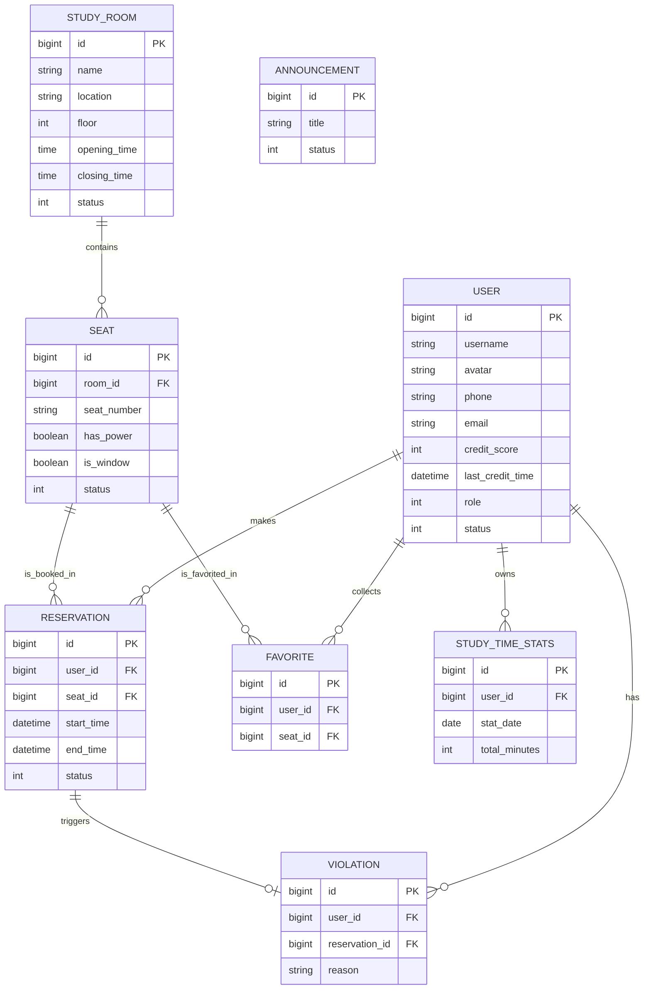

# 自习室座位预约系统 - 数据库设计文档

## 一、 数据库概览
- **数据库类型**: MySQL 8.x
- **缓存策略**: Redis (用于存放射频 Token、自习室实时状态缓存及并发预约锁)
- **数据库名**: `study_room_db`

---

## 二、 实体关系图 (ER Diagram)

> [!NOTE]
> 如果您无法看到图片，请确保您的 Markdown 编辑器已安装 **Mermaid** 插件（如 VS Code 的 Mermaid Editor 或 Markdown Preview Mermaid Support）。

---

## 三、 表结构详细设计

### 3.1 用户表 (users)
| 字段名 | 类型 | 约束 | 描述 |
| :--- | :--- | :--- | :--- |
| id | bigint | PK, Auto_Inc | 用户主键 |
| username | varchar(50) | Unique, Not Null | 用户名/登录账号 |
| password | varchar(255) | Not Null | 加密后的密码 |
| avatar | varchar(255) | - | 头像 URL（默认为用户名的首字符） |
| phone | varchar(20) | Unique | 手机号 |
| email | varchar(100) | Unique | 邮箱 |
| credit_score | int | Default 100 | 信誉分（初始100，签到+5，违约-10） |
| last_credit_time | datetime | - | 最后信誉分变动时间 |
| role | tinyint | Default 2 | 角色 (1: 管理员, 2: 普通用户) |
| status | tinyint | Default 1 | 状态 (0: 禁用, 1: 正常) |
| created_at | datetime | Default Now | 注册时间 |
| updated_at | datetime | Default Now | 更新时间 |

### 3.2 自习室表 (study_rooms)
| 字段名 | 类型 | 约束 | 描述 |
| :--- | :--- | :--- | :--- |
| id | bigint | PK, Auto_Inc | 自习室主键 |
| name | varchar(100) | Not Null | 自习室名称 |
| location | varchar(255) | - | 地理位置/详细地址 |
| floor | int | - | 楼层 |
| opening_time | time | - | 每日开放时间 (如 07:00:00) |
| closing_time | time | - | 每日关闭时间 (如 22:30:00) |
| description | text | - | 自习室简介 |
| status | tinyint | Default 1 | 运营状态 (0: 维护中/关闭, 1: 开放) |

### 3.3 座位表 (seats)
| 字段名 | 类型 | 约束 | 描述 |
| :--- | :--- | :--- | :--- |
| id | bigint | PK, Auto_Inc | 座位主键 |
| room_id | bigint | FK, Index | 所属自习室 ID |
| seat_number | varchar(20) | Not Null | 座位编号 (如 A-01) |
| position_x | int | - | 可视化坐标 X |
| position_y | int | - | 可视化坐标 Y |
| has_power | boolean | Default False | 是否有电源插座 |
| is_window | boolean | Default False | 是否靠窗 |
| status | tinyint | Default 1 | 当前状态 (0: 维修, 1: 可用, 2: 占用) |

### 3.4 预约流水表 (reservations)
| 字段名 | 类型 | 约束 | 描述 |
| :--- | :--- | :--- | :--- |
| id | bigint | PK, Auto_Inc | 预约主键 |
| user_id | bigint | FK, Index | 用户 ID |
| seat_id | bigint | FK, Index | 座位 ID |
| start_time | datetime | Not Null | 预约开始时间 |
| end_time | datetime | Not Null | 预期结束时间 |
| check_in_time | datetime | - | 实际签到时间 |
| status | tinyint | Index | 状态 (0:取消, 1:待使用, 2:使用中, 3:已完成, 4:违约) |
| created_at | datetime | Default Now | 提交预约的时间 |

### 3.5 违约记录表 (violations)
| 字段名 | 类型 | 约束 | 描述 |
| :--- | :--- | :--- | :--- |
| id | bigint | PK | 记录 ID |
| user_id | bigint | FK | 用户 ID |
| reservation_id | bigint | FK | 关联的预约 ID |
| reason | varchar(255) | - | 违约原因 (如：未按时签到) |
| created_at | datetime | - | 记录时间 |

### 3.6 公告与内容控制
*   **announcements**: 存储系统通知 (id, title, content, status, created_at)
*   **carousels**: 存储首页轮播图 (id, image_url, sort_order, status)
*   **favorites**: 用户收藏推荐座位 (id, user_id, seat_id)

### 3.7 学习时长统计 (study_time_stats)
| 字段名 | 类型 | 约束 | 描述 |
| :--- | :--- | :--- | :--- |
| id | bigint | PK | 主键 |
| user_id | bigint | Index | 用户 ID |
| stat_date | date | Index | 统计日期 |
| total_minutes | int | - | 当日学习总时长 (分钟) |

---

## 四、 索引与优化建议
1.  **预约查询优化**: 在 `reservations` 表的 `user_id` 和 `status` 字段建立联合索引，加速“我的预约”列表查询。
2.  **并发控制**: 座位状态变更使用乐观锁 (`version`) 或 Redis 分布式锁确保在高并发选座场景下的原子性。
3.  **统计查询**: `study_time_stats` 按 `user_id` 和 `stat_date` 建立联合索引，提升日/周/月报表聚合速度。
